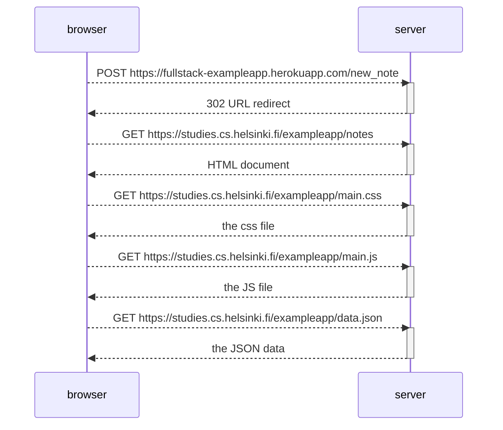

```mermaid
sequenceDiagram
  participant browser
  participant server

  browser-->>server: POST https://fullstack-exampleapp.herokuapp.com/new_note
  activate server
  server-->>browser: 302 URL redirect
  deactivate server

  browser-->>server: GET https://studies.cs.helsinki.fi/exampleapp/notes
  activate server
  server-->>browser: HTML document
  deactivate server

  browser-->>server: GET https://studies.cs.helsinki.fi/exampleapp/main.css
  activate server
  server-->>browser: the css file
  deactivate server

  browser-->>server: GET https://studies.cs.helsinki.fi/exampleapp/main.js
  activate server
  server-->>browser: the JS file
  deactivate server

  browser-->>server: GET https://studies.cs.helsinki.fi/exampleapp/data.json
  activate server
  server-->>browser: the JSON data
  deactivate server
```
